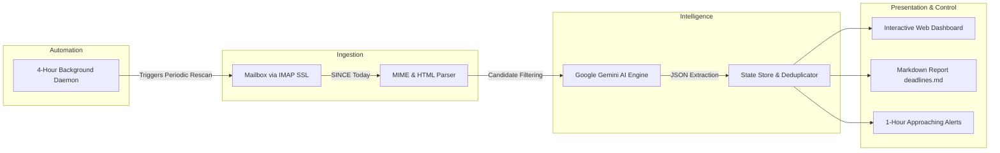

# DeadlinePilot: Intelligent Email Deadline & Task Extraction Agent

[](https://deadline-pilot.onrender.com/)
[](https://www.python.org/)
[](https://fastapi.tiangolo.com/)
[](https://aistudio.google.com/)
[](./LICENSE)

DeadlinePilot is an automated background service and interactive web application designed to eliminate missed deadlines from incoming email announcements. It connects securely to any IMAP mailbox, retrieves emails received on the current date, extracts actionable registration and event deadlines using Google Gemini AI, and transforms them into an interactive Todo dashboard.

[Live Web Application](https://deadline-pilot.onrender.com/) | [GitHub Repository](https://github.com/Keshav-spec/Email-agent) | [Deployment Guide](./DEPLOYMENT_GUIDE.md) | [Version Changelog](./CURRENT_VERSION.md)

---

## System Overview



---

## Key Features

### 1. Interactive Todo Web Interface
- Converts unstructured email deadlines into manageable task cards.
- Circular completion controls remove tasks from active view and archive them under a dedicated Completed section.
- Built-in restore and undo actions for easy task re-activation.
- Real-time search by title, sender, or context, alongside urgency filtering:
  - Critical: Due in less than 48 hours.
  - Upcoming: Due in 3 to 7 days.
  - Later: Due after 7 days.

### 2. On-Demand and Automated Synchronization
- **On-Demand Rescan**: A dashboard trigger allows users to run immediate mailbox analysis and update task lists on demand.
- **Automated 4-Hour Background Polling**: An asynchronous worker executes scheduled scans every 4 hours, complemented by a real-time countdown clock in the web header.

### 3. Google Gemini AI Extraction Engine
- Uses Google Gemini models (`gemini-3-flash-preview` / `gemini-2.5-flash`) for date and context extraction.
- **Batch Processing**: Groups candidate emails into batches of 4 per request, reducing API overhead by approximately 75% and preventing rate-limiting on free-tier quotas.
- **Multi-Model Failover**: Seamlessly shifts to alternate Gemini endpoints if quota spikes or transient server errors occur.
- **Offline Heuristic Parser**: Zero-dependency regex and date parser fallbacks when testing offline or without an active API key.

### 4. Comprehensive Mailbox Scanning
- Scans all incoming emails received today (`TODAY_ONLY=True`), covering both unread and previously opened messages (`UNREAD_ONLY=False`).
- Non-destructive fetching using `BODY.PEEK[]` ensures inbox status flags remain unchanged unless explicitly configured otherwise.

### 5. Persistent State & Markdown Synchronization
- Deadlines remain active across application runs until explicitly marked complete.
- State is synchronized bi-directionally between `deadlines_state.json` and `deadlines.md`. Updating a task checkbox to `- [x]` in Markdown automatically archives the task upon the next scan.

### 6. Proactive Alerts
- Scans for pending deadlines due within 60 minutes.
- Triggers native desktop notifications, system audio chimes, and prominent terminal warnings with anti-spam suppression.

---

## Technology Stack

| Layer | Technology |
|---|---|
| Web Framework | FastAPI, Uvicorn |
| Frontend | Vanilla HTML5, Modern CSS (Glassmorphism), JavaScript (ES6+) |
| AI / LLM | Google Gemini API (`generativelanguage.googleapis.com`) |
| Mail Protocol | Python `imaplib`, `email`, MIME RFC 2047 Decoders |
| HTML Processing | BeautifulSoup4 |
| Data Validation | Pydantic v2 |
| Terminal Output | Rich |
| Deployment | Render Cloud, Docker, Procfile |

---

## REST API Reference

The web server exposes the following endpoints:

| Method | Endpoint | Description |
|---|---|---|
| `GET` | `/` | Serves the main Todo web dashboard |
| `GET` | `/api/deadlines` | Returns active and completed deadline items with metadata |
| `POST` | `/api/deadlines/{id}/complete` | Marks a deadline as completed |
| `POST` | `/api/deadlines/{id}/uncomplete` | Restores a completed deadline to active status |
| `DELETE` | `/api/deadlines/{id}` | Permanently removes a deadline from tracking |
| `POST` | `/api/rescan` | Triggers immediate mailbox fetch, Gemini extraction, and alert check |
| `GET` | `/api/status` | Returns scheduler status, last scan timestamp, and metrics |

---

## Local Installation & Setup

### Prerequisites
- Python 3.10, 3.11, or 3.12
- Google Gemini API Key ([Google AI Studio](https://aistudio.google.com/))
- Email account with IMAP enabled and an App Password (for Gmail, generate via 2-Step Verification)

### Step 1: Clone Repository
```bash
git clone https://github.com/Keshav-spec/Email-agent.git
cd Email-agent
```

### Step 2: Set Up Virtual Environment
```bash
python -m venv .venv

# Windows (Command Prompt / PowerShell):
.venv\Scripts\activate

# macOS / Linux:
source .venv/bin/activate
```

### Step 3: Install Dependencies
```bash
pip install -r requirements.txt
```

### Step 4: Configure Environment Variables
Create a `.env` file in the project root:
```env
# Mailbox Configuration
EMAIL_ADDRESS=your_email@gmail.com
EMAIL_PASSWORD=abcd efgh ijkl mnop
IMAP_HOST=imap.gmail.com
IMAP_PORT=993
USE_SSL=True

# Google Gemini Configuration
GEMINI_API_KEY=your_gemini_api_key_here
GEMINI_MODEL=gemini-3-flash-preview

# Agent Scanning Preferences
TODAY_ONLY=True
UNREAD_ONLY=False
ALERT_WINDOW_MINUTES=60
FETCH_LIMIT=50
OUTPUT_PATH=deadlines.md
```

### Step 5: Run Application

#### Option A: Web Dashboard (Recommended)
```bash
python app.py
```
Open [http://localhost:8000](http://localhost:8000) in your web browser.

#### Option B: Command Line Interface
```bash
# Scan today's mailbox once:
python main.py

# Run in background daemon mode (polls every 300 seconds):
python main.py --daemon --interval 300

# Mark a task complete via CLI:
python main.py --complete adc4863f

# Run with synthetic test emails (no credentials required):
python main.py --mock
```

---

## Docker Deployment

Build and run using the included Docker configuration:

```bash
# Build Docker image:
docker build -t deadline-pilot .

# Run container:
docker run -d -p 8000:8000 --env-file .env --name deadline-pilot deadline-pilot
```

Access the dashboard at [http://localhost:8000](http://localhost:8000).

---

## Cloud Deployment (Render.com)

The project includes pre-configured [`render.yaml`](./render.yaml) and [`Procfile`](./Procfile) files for automated deployment:

1. Create a free account at [Render.com](https://render.com/).
2. Select **New +** -> **Blueprint**.
3. Connect the repository `https://github.com/Keshav-spec/Email-agent`.
4. Supply your secret environment variables (`EMAIL_ADDRESS`, `EMAIL_PASSWORD`, `GEMINI_API_KEY`).
5. Click **Apply** to deploy.

For complete instructions, refer to the [Deployment Guide](./DEPLOYMENT_GUIDE.md).

---

## Automated Testing

The test suite validates email decoding, HTML link extraction, Gemini heuristic parsing, chronological sorting, state management, and alert handling:

```bash
python -m unittest discover tests -v
```

All 12 unit tests execute locally in under 0.5 seconds with zero external network dependencies.

---

## Project Structure

```text
Email-agent/
|-- .dockerignore             # Docker build exclusion rules
|-- .env.example              # Environment variables template
|-- .gitignore                # Git credential and artifact ignore rules
|-- CURRENT_VERSION.md        # Feature inventory and release notes
|-- DEPLOYMENT_GUIDE.md       # Cloud deployment instructions
|-- Dockerfile                # Production container specification
|-- Procfile                  # Process definition for PaaS hosting
|-- README.md                 # Project documentation
|-- app.py                    # Standalone web server launcher
|-- deadlines.md              # Synchronized Markdown dashboard
|-- deadlines_state.json      # Persistent tracking database
|-- main.py                   # CLI entry point and daemon runner
|-- render.yaml               # Render Infrastructure-as-Code Blueprint
|-- requirements.txt          # Python dependencies
|-- src/
|   |-- __init__.py           # Package initialization
|   |-- alerts.py             # Desktop, audio, and terminal alert dispatcher
|   |-- config.py             # Environment configuration parser
|   |-- connector.py          # Secure IMAP connector and HTML parser
|   |-- mock_data.py          # Offline synthetic test dataset
|   |-- models.py             # Pydantic data schemas
|   |-- parser.py             # Google Gemini extraction and batching engine
|   |-- reporter.py           # Markdown table and dashboard generator
|   |-- server.py             # FastAPI web server and 4-hour background scheduler
|   |-- state_manager.py      # Persistence store and checkbox synchronization
|   `-- web/
|       |-- app.js            # Reactive frontend dashboard controller
|       |-- index.html        # Responsive web interface template
|       `-- style.css         # Custom design system and components
`-- tests/
    |-- test_connector.py     # IMAP header decoding and link tests
    |-- test_parser.py        # Date parsing and filter tests
    |-- test_reporter.py      # Markdown output formatting tests
    `-- test_state_and_alerts.py # Alert trigger and state persistence tests
```

---

## License

This project is licensed under the MIT License. See the [LICENSE](./LICENSE) file for details.
